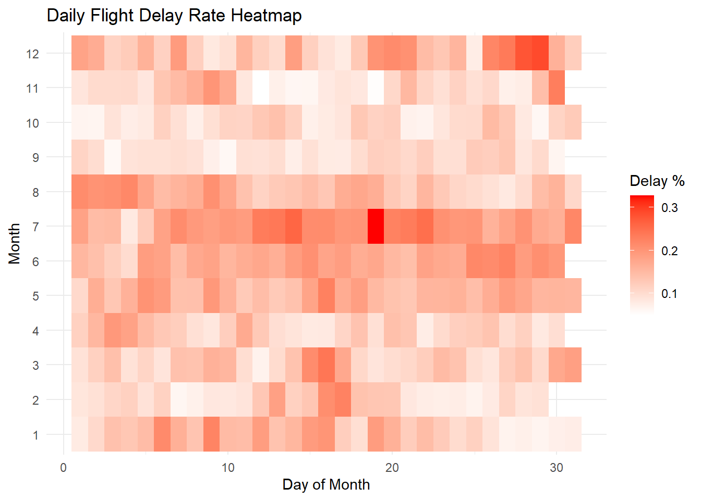
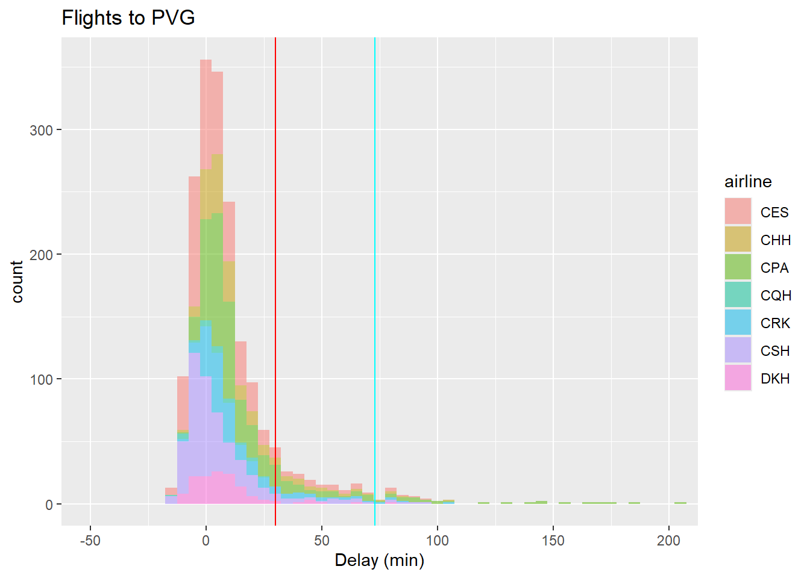
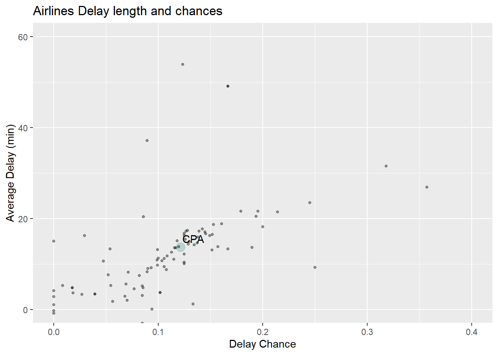

# ✈️ Flight Delay Analysis

A data science project investigating flight delay patterns across the United States and Hong Kong using over 1.4 billion flight data points from aviation datasets. This project explores factors associated with flight performance at the airport, airline, and individual flight levels through data cleaning, exploratory analysis, visualization, and statistical testing.

---

## 📌 Overview

Flight delays affect millions of passengers every year and have significant economic and operational impacts. This project analyzes historical flight records to answer questions such as:

* Which airports experience the highest delay rates?
* Which airlines are more likely to be delayed?
* Do specific routes or flights consistently experience delays?
* Are observed differences statistically significant?

---

## 📊 Datasets

### United States Flight Data

* Source: Bureau of Transportation Statistics (BTS)
* Coverage: Domestic flights in the United States
* Variables include:

  * Airline
  * Origin and destination airports
  * Departure delay
  * Arrival delay
  * Cancellation information
  * Flight date and time

### Hong Kong Flight Data

* Source: data.gov.hk API (HKG)
* Coverage: Flights arriving at and departing from HKG
* Variables include:

  * Airline
  * Flight number
  * Scheduled and actual times
  * Delay status
  * Origin and destination locations

---

## 🔍 Project Objectives

1. Clean and preprocess large-scale flight datasets.
2. Explore delay distributions and temporal patterns.
3. Compare delay rates among airports and airlines.
4. Analyze individual flight performance.
5. Perform statistical tests to determine whether differences are significant.
6. Visualize insights and communicate findings effectively.

---

## 🛠️ Tools

* **R**
* **tidyverse**
* **ggplot2**
* **dplyr**
* **tidyr**
* **readr**
* **lubridate**
* **R Markdown**

---

## 📈 Analysis Performed

### Exploratory Data Analysis

* Delay distributions
* Monthly and seasonal trends
* Airport-level comparisons
* Airline performance analysis

### Visualization

* Histograms
* Bar charts
* Time-series plots
* Comparative charts

### Statistical Analysis

* Chi-square tests
* Hypothesis testing
* Comparison of delay proportions

---

## 📂 Repository Structure

```
.
├── data/                  # Raw and processed datasets
├── figures/               # Figures/Charts made by the script
├── report/                # R Markdown report and output files
├── scripts/               # Data cleaning and analysis scripts
└── README.md
```
## 📊 Example Visualizations

### Delay Chance by Date Heatmap

<p align="center">
  
  <br>
  <em>Figure 1. Delay Chance by Date</em>
</p>

### Flights to PVG Delay Statistics

<p align="center">
  
  <br>
  <em>Figure 2. The Delay Statistics of Flights to PVG</em>
</p>

### How Cathay Pacific compares with other airlines

<p align="center">
  
  <br>
  <em>Figure 3. Airline Performance Scatterplot</em>
</p>

---

## 🚀 Key Findings

* Flight delays vary considerably across airports and airlines.
* Certain routes and individual flights exhibit consistently higher delay rates.
* Delay patterns differ between the United States and Hong Kong datasets.
* Statistical tests indicate that some observed differences are unlikely to be due to random variation.

---

## 📄 Report

The complete analysis, methodology, and visualizations are available in the project report:

```
report/Report.html
```

---

## 👤 Author

**Fahtai Tanawongsuwan**

This project is an extension of the authors' original course project for the *COMP2501 Introduction to Data Science* course at The University of Hong Kong. It builds upon the existing work and incorporates further data analysis, statistical testing, and visualization to provide deeper insights into flight delay patterns.

---

## License

This project is intended for educational purposes.
